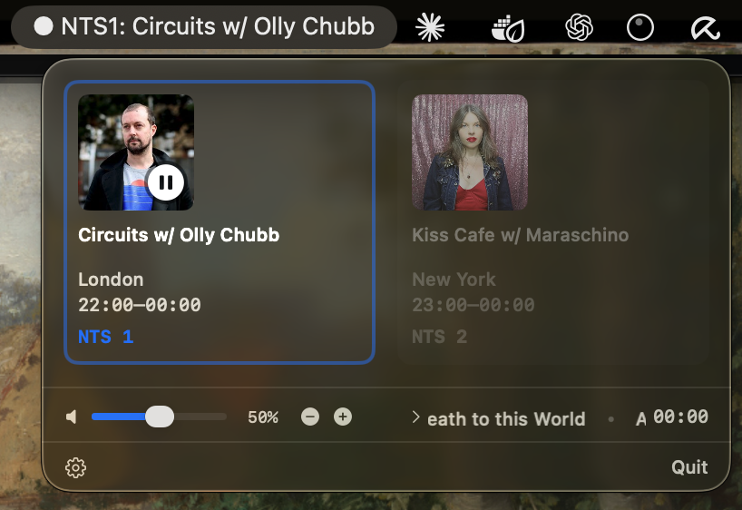

# NTS Radio Utility

A clean, native macOS menu bar app for streaming NTS Radio.

<p align="center">
  
</p>

> **⚠️ Unofficial Project**: This is a fan-made application and is **not affiliated with, endorsed by, or connected to NTS Radio** in any way. All NTS Radio content, streams, artwork, and branding are © NTS Radio Ltd.

## Installation

1. **Download** the latest DMG from the Github repository sidebar, under 'Releases'.
2. **Open** the DMG file
3. **Drag** NTS Radio Utility to your Applications folder
4. **Launch** the app from Applications
5. The **NTS Radio Utility** will appear in your menu bar

> **Note**: On first launch, macOS may ask you to confirm opening an app from an unidentified developer. Right-click the app and select "Open" to bypass this.

## Features

### 🎵 Dual Channel Streaming
- Stream both NTS 1 and NTS 2
- View both stations simultaneously in side-by-side cards
- Quick station switching with visual feedback

### 📻 Live Show Information
- Current show title, DJ/host, and location
- Show artwork and timing
- "Next up" preview with marquee scrolling
- Auto-refresh when shows change (no manual refreshing needed!)

### 🎛️ Native Controls
- Play/pause with buffering indicator
- Independent volume control (doesn't affect system volume)
- Compact, Mac-native design

### ⌨️ Keyboard Shortcuts
- **Space**: Play/pause
- **1**: Switch to NTS 1 (auto-plays if stopped)
- **2**: Switch to NTS 2 (auto-plays if stopped)
- **⌘,**: Open settings

### ⚙️ Settings
- **Launch at Login**: Start NTS Radio Utility automatically
- **Auto-play on Launch**: Begin playing immediately when app opens
- Volume and station preferences saved between sessions

## Requirements

- macOS 13.0 or later
- Internet connection for streaming

## Privacy

NTS Radio Utility:
- Only connects to NTS Radio's public API and streaming servers
- Does not collect, store, or transmit any user data
- Runs entirely locally on your Mac

## About NTS Radio

[NTS Radio](https://www.nts.live) is a globally recognized online radio station and music discovery platform broadcasting from London, Los Angeles, Manchester, and beyond.

**If you enjoy this app, please support NTS directly:**
- 🎧 Listen on their [official website](https://www.nts.live) and apps
- 💝 [Become an NTS Supporter](https://www.nts.live/supporters)
- 📱 Download their official [iOS](https://apps.apple.com/app/nts-radio/id577440097) and [Android](https://play.google.com/store/apps/details?id=live.nts.android) apps

This project exists because I love NTS and wanted a better desktop experience. All credit for the amazing content goes to NTS Radio and their incredible roster of DJs and hosts.

---

## For Developers

### Building from Source

**Requirements:**
- macOS 13.0+
- Xcode 15.0+
- Swift 5.9+

**Build Steps:**

1. Clone the repository:
   ```bash
   git clone https://github.com/mderdun/NTS-Radio-Utility.git
   cd nts-radio-utility
   ```

2. Open in Xcode:
   ```bash
   open "NTS Radio Utility.xcodeproj"
   ```

3. Build and run (⌘R)

### Architecture

```
NTS Radio Utility/
├── Models/              # Data models for API responses
├── Services/
│   ├── NTSAPIService    # Fetches live show data
│   └── AudioPlayerService # AVPlayer wrapper for streaming
├── ViewModels/
│   └── RadioViewModel   # State management and business logic
└── Views/
    ├── MenuBarView      # Menu bar icon with scrolling title
    ├── PopoverView      # Dual-channel card layout
    ├── SettingsView     # Preferences popover
    └── Components/      # Reusable components (MarqueeText, etc.)
```

### API

The app uses NTS Radio's public endpoints:
- **Live data**: `https://www.nts.live/api/v2/live`
- **Stream URLs**:
  - NTS 1: `https://streams.radiomast.io/nts1`
  - NTS 2: `https://streams.radiomast.io/nts2`

### Technical Highlights

- **Smart refresh timing**: Automatically fetches new show data when programs end
- **No cache issues**: All API requests bypass cache for real-time data
- **Concurrency-safe**: Thread-safe marquee with NSLock and @MainActor
- **Modern APIs**: Uses AVAsyncProperty and AVPlayerItemMetadataOutput
- **Sandboxed**: Full App Sandbox compliance with network entitlements

---

## Legal

### License

This project is licensed under the MIT License - see [LICENSE](./LICENSE.md) file for details.

**Important**: The MIT License applies **only to the source code** of this application. It does not apply to:
- NTS Radio content, streams, or metadata
- NTS Radio branding, logos, or trademarks
- Show artwork and images
- Any content owned by NTS Radio Ltd.

### Trademarks & Content

- "NTS" and the NTS Radio logo are trademarks of NTS Radio Ltd.
- All audio streams, show information, artwork, and metadata are © NTS Radio Ltd.
- This app accesses publicly available streams and data but does not claim any ownership.

### Disclaimer

This software is provided "as is" without warranty of any kind. The creator is not responsible for any issues arising from the use of this application.

### Takedown Policy

If you are a representative of NTS Radio and have concerns about this project, please contact me via GitHub issues and I will respond promptly.

---

## Support

This is an unofficial, community-built app.

- **For app issues**: [Open a GitHub issue](https://github.com/mderdun/NTS-Radio-Utility/issues)
- **For NTS Radio support**: Visit [nts.live](https://www.nts.live)

---

**Made with ❤️ for the NTS community**
